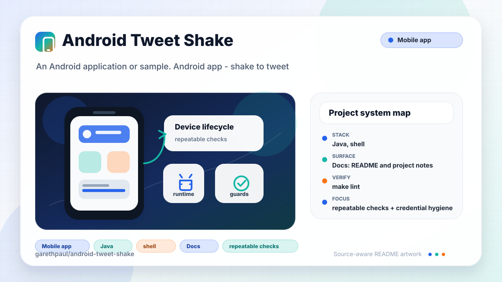

# android-tweet-shake

<!-- README-OVERVIEW-IMAGE -->


## Overview

`garethpaul/android-tweet-shake` is an Android application or sample. Android app - shake to tweet

This legacy Android sample signs in with Twitter and opens a tweet composer
when the user shakes the phone.

This README is based on the checked-in source, manifests, scripts, and repository metadata on the `master` branch. The project language mix found during review was: Java (5), shell (1).

## Repository Contents

- `README.md` - project overview and local usage notes
- `build.gradle` - Android or Gradle build configuration
- `app` - source or example code
- `docs` - source or example code
- `gradle` - source or example code
- `gradlew` - Android or Gradle build configuration
- `scripts` - source or example code
- `SECURITY.md` - security reporting and disclosure guidance
- `VISION.md` - project direction and maintenance guardrails

Additional scan context:

- Source directories: app, docs, gradle, scripts
- Dependency and build manifests: build.gradle, gradlew
- Entry points or build surfaces: Gradle build files
- Test-looking files: app/src/androidTest/java/gpj/tweetshake/ApplicationTest.java, app/src/test/java/gpj/tweetshake/ShakeDetectorTest.java

## Getting Started

### Prerequisites

- Git
- Android Studio or a compatible Android SDK
- Gradle or the checked-in Gradle wrapper when present

### Setup

```bash
git clone https://github.com/garethpaul/android-tweet-shake.git
cd android-tweet-shake
make check
scripts/check-baseline.sh
./gradlew lint --no-daemon
./gradlew test --no-daemon
./gradlew assembleDebug --no-daemon
```

The setup commands above are derived from repository files. Legacy mobile, Python, or JavaScript samples may require older SDKs or package versions than a modern workstation uses by default.

## Running or Using the Project

- Use Android Studio to open the project or run `./gradlew assembleDebug` when the Android SDK is configured.

## Testing and Verification

- `make lint` - runs the SDK-free baseline and Gradle lint when the Android SDK is configured.
- `make test` - runs Gradle tests when the Android SDK is configured.
- `make build` - runs debug assembly when the Android SDK is configured.
- `make check` - runs the aggregate lint, test, and build gates.
- `scripts/check-baseline.sh` - runs SDK-free source baseline checks.
- The baseline protects threshold units, finite sensor handling, debounce
  behavior, credential placeholders, generic login-failure feedback, and legacy
  build guardrails.
- Shake debounce uses Android's monotonic elapsed realtime clock so wall-clock
  changes do not affect shake timing.
- `./gradlew lint --no-daemon`, `./gradlew test --no-daemon`, and `./gradlew assembleDebug --no-daemon` when the Android SDK is configured.

When the required SDK or runtime is unavailable, use static checks and source review first, then verify on a machine that has the matching platform toolchain.

## Configuration and Secrets

- Detected references to Twitter. Keep API keys, OAuth credentials, tokens, and account-specific values in local configuration only.
- Committed Twitter and Fabric credential placeholders must stay empty. Real
  keys, tokens, signing files, and machine-local Fabric properties belong
  outside Git.
- Local builds with empty Twitter credentials stop SDK initialization and show
  generic unavailable feedback.
- Twitter login failures show a generic resource-backed message and do not log
  exception or session details.
- Missing Twitter login button wiring shows a generic resource-backed message
  and skips activity-result forwarding instead of crashing.

## Security and Privacy Notes

- Review changes touching authentication or token handling; examples from the scan include docs/plans/2026-06-08-tweet-shake-lint-resource-baseline.md, docs/plans/2026-06-08-tweet-shake-sensor-build-baseline.md.
- Review changes touching external API calls or credential-adjacent configuration; examples from the scan include app/build.gradle, app/src/main/AndroidManifest.xml, app/src/main/java/gpj/tweetshake/MainActivity.java, app/src/main/java/gpj/tweetshake/ShakeActivity.java, and 5 more.
- Review changes touching network requests, sockets, or service endpoints; examples from the scan include app/build.gradle, app/src/androidTest/java/gpj/tweetshake/ApplicationTest.java, app/src/main/AndroidManifest.xml, app/src/main/res/layout/activity_main.xml, and 6 more.
- Review changes touching mobile permissions or privacy-sensitive device data; examples from the scan include app/src/main/AndroidManifest.xml, app/src/main/java/gpj/tweetshake/ShakeActivity.java, docs/plans/2026-06-08-tweet-shake-sensor-build-baseline.md, gradlew, and 1 more.
- Review changes touching file, media, JSON, XML, CSV, OCR, or data parsing; examples from the scan include app/lint.xml, app/src/main/AndroidManifest.xml, app/src/main/java/gpj/tweetshake/MainActivity.java, app/src/main/java/gpj/tweetshake/ShakeActivity.java, and 5 more.
- Review changes touching database, model, or persistence code; examples from the scan include docs/plans/2026-06-08-tweet-shake-sensor-build-baseline.md.

## Maintenance Notes

- This looks like a legacy Android project or sample. Expect Android SDK, Gradle, and support-library versions to matter.
- The current baseline initializes and unregisters the accelerometer listener
  through the activity lifecycle, tests the shake threshold/debounce logic in a
  small detector, compares acceleration magnitude against the configured 2.0g
  threshold, rejects non-finite accelerometer values without consuming debounce
  state, uses monotonic elapsed realtime for shake debounce timing, keeps the
  resource lint gate clean, pins compatible legacy build tooling, disables
  Crashlytics processing for empty-key local builds, and removes generated IDE
  metadata from version control. Login failures surface a generic message
  without printing Twitter exception details.
- Future work should replace Fabric/Twitter Kit with maintained APIs if the app
  is revived, add hardware or emulator verification for shake behavior, and
  modernize SDK/dependency levels in a dedicated pass.
- See `SECURITY.md` for vulnerability reporting and safe research guidance.
- See `VISION.md` for project direction and contribution guardrails.
- See `CHANGES.md` for the maintenance history.
- See `docs/plans/2026-06-08-shake-threshold-gravity-baseline.md` for the
  shake-threshold gravity baseline.
- See `docs/plans/2026-06-08-shake-finite-acceleration-baseline.md` for the
  non-finite sensor input baseline.
- See `docs/plans/2026-06-09-shake-invalid-input-debounce-baseline.md` for the
  invalid sensor debounce regression coverage.
- See `docs/plans/2026-06-09-shake-monotonic-debounce-time.md` for the
  monotonic shake debounce timing contract.
- See `docs/plans/2026-06-09-tweet-login-failure-feedback.md` for the generic
  login-failure feedback baseline.
- See `docs/plans/2026-06-09-tweet-login-button-guard.md` for the login button
  availability guard.
- See `docs/plans/2026-06-09-tweet-shake-make-gate-targets.md` for the root
  lint, test, and build gate contract.
- See `docs/plans/2026-06-09-tweet-empty-credential-guard.md` for the empty
  credential SDK initialization guard.

## Contributing

Keep changes small and tied to the project that is already present in this repository. For code changes, document the toolchain used, avoid committing generated dependency directories or local configuration, and update this README when setup or verification steps change.
